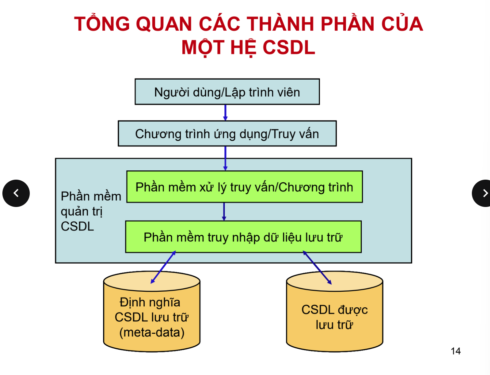
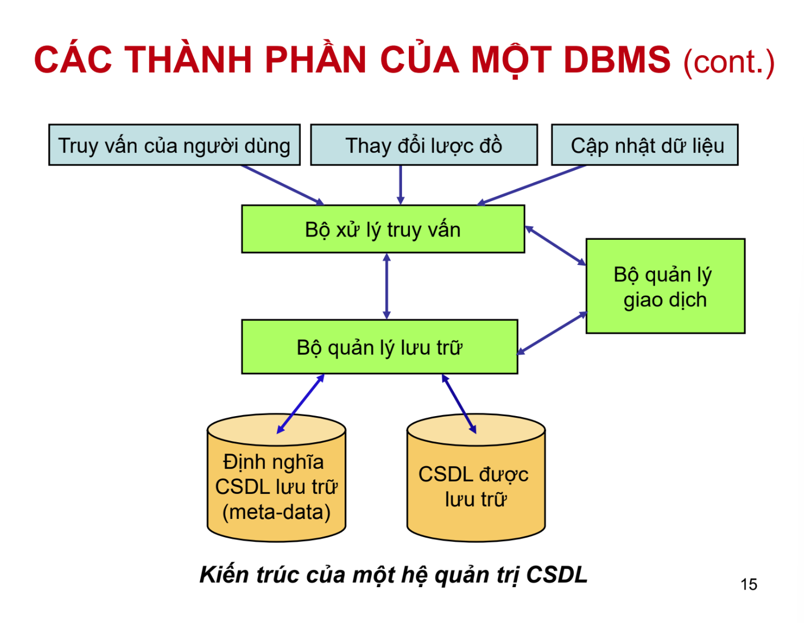

### prokyurem

---

### Khái niệm cơ bản về cơ sở dữ liệu

- _Cơ sở dữ liệu(database)_ là một tập thông tin(dữ liệu) có liên quan đến nhau.
- _Dữ liệu_ trong CSDL có thể là: chữ số, văn bản, đồ họa, video,...
- _CSDL_ được coi là một tập dữ liệu gắn kết logic với nhau. Các dữ liệu ngẫu nhiên không được coi là một _CSDL_.

---

### Cơ sở dữ liệu, hệ quản trị cơ sở dữ liệu, hệ cơ sở dữ liệu

**Hệ quản trị CSDL**

- _Hệ quản trị CSDL(DBMS - Database managemnent system)_ là một hệ thống phần mềm cho phép tạo lập CSDL và điều khiển mọi truy cập đến CSDL đó.
- Các đặc tính quan trọng của một hệ quản trị CSDL:

1. `Cho phép người dùng tạo CSDL`, thông qua ngôn ngữ định nghĩa dữ liệu(DDLs - Data Manipulation Languages).
2. `Cho phép người dùng truy vấn sở dữ liệu`, thông qua ngôn ngữ thao tác dữ liệu(DMLs - Data Manipulation Languages).
3. `Hỗ trợ lưu trữ số lượng lớn dữ liệu`, duy trì tính bảo mật và tính toàn vẹn trong quá trình xử lý.
4. `Kiểm soát truy nhập dữ liệu` từ người dùng tại một thời điểm

**Hệ cơ sở dữ liệu**

- Một CSDL được quản lý bởi một hệ quản trị CSDL thường được gọi là một _Hệ cơ sở dữ liệu_.
- Hệ CSDL gồm 4 thành phần:

1. `CSDL hợp nhất`: có 2 tính chất là tối thiểu hóa dư thừa và được chia sẻ.
2. `Người dùng`: là những người có nhu cầu truy nhập vào CSDL.
3. `Phần mềm hệ quản trị CSDL`.
4. `Phần cứng`: thiết bị lưu trữ CSDL.

---

_Tổng quan các thành phần của một hệ CSDL_

---

_Các thành phần của một DBMS_

---

-_Các thành phần của một DBMS_

- **CSDL lưu trữ và meta-data**:
  1. CSDL được lưu trữ tại thiết bị nhớ thứ cấp hoặc cấp 3.
  2. Meta-data(siêu dữ liệu) là dữ liệu về dữ liệu: Mô tả các thành phần dữ liệu của CSDL.
  3. Với mỗi CSDL, hệ quản trị CSDL có thể duy trì nhiều chỉ mục khác nhau dược thiết kế để cung cấp truy nhập nhanh tới dữ liệu ngẫu nhiên.
  4. Trong các CSDL hiện đạ, hầu hết các chỉ mục được biểu diễn dưới dạng B-tree(cây tìm kiếm nhị phân). Các B-tree có xu hướng truy nhập nhanh từ gốc.
- **Bộ quản lý lưu trữ**:
  1. Bộ quản lý tệp: Lưu vị trí các tệp trên ổ đĩa và lấy ra được khối hoặc các khối chứa tệp theo yêu cầu từ bộ quản lý vùng đệm.
  2. Bộ quản lý vùng đệm: Quản lý bộ nhớ chính. Lấy các khối dữ liệu từ ổ đĩa, qua bộ quản lý tệp, và chọn một trang trong bộ nhớ chính để lưu trữ.
- **Bộ xử lý truy vấn**:
  - Biến đổi một câu truy vân hoặc một thao tác CSDL(ngôn ngữ SQL) thành một chuỗi các yêu cầu đối với dữ liệu được lưu trữ trong CSDL.
  - Phần phức tạp nhất của bộ xử lý truy vấn là `tối ưu hóa truy vấn`.
- **Bộ quản lý giao dịch**
  Gồm 4 tính chất được gọi là thuộc tính ACID.
  1. Tính nguyên tố(Atomicity): tất cả các thao tác của giao dịch được thực hiện hoặc không thao tác nào được thực hiện.
  2. Tính nhất quán(Consistency): các thao tác phải đảm bảo tính nhất quán của CSDL.
  3. Tính biệt lập(Isolation): các giao dịch phải đồng thời tách riêng biệt với nhau.
  4. Tính duy trì(Durability): những thay đổi tới CSDL bởi một giao dịch sẽ không bị mất đi ngay cả khi hệ thống có lỗi ngay khi giao dịch hoàn thành.
- **Ba kiểu thao tác**:
  - Truy vấn của người dùng, cập nhật dữ liệu, thay đổi lược đồ.

---

-_Dữ liệu dẫn xuất và dữ liệu vật lý_

-**Dữ liệu vật lý**: là những dữ liệu có thực được nhập trong CSDL.

-**Dữ liệu dẫn xuất**: là những dữ liệu được tính toán từ những dữ liệu nằm trong CSDL.
